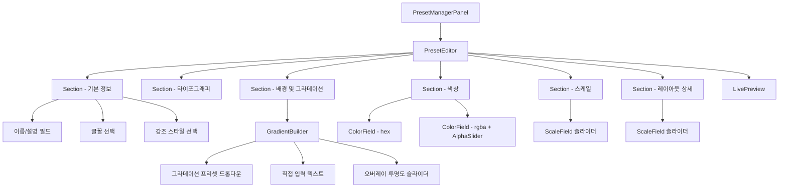

# 디자인 문서: 프리셋 에디터 리디자인

## 개요

기존 `PresetEditor.jsx` 컴포넌트를 리팩토링하여 디자인 이미지에 맞는 UI로 개편한다. 핵심 변경 사항은 다음과 같다:

1. `titleScaleLandscape` 필드 제거 (스케일 섹션 5개 → 4개)
2. `ColorField` 컴포넌트 개선: rgba 색상에도 컬러 피커 표시 + 알파 슬라이더 추가
3. `GradientBuilder` 컴포넌트 신규 생성: CSS 직접 입력 → 프리셋 드롭다운 + 직접 입력 + 오버레이 투명도 슬라이더
4. 섹션 구조 통합: 8개 → 6개 (글꼴/강조 스타일을 기본 정보로 통합)
5. 섹션 기본 상태 변경: 기본 정보/타이포그래피만 펼침

기존 데이터 레이어(`presetStorage.js`, `presetValidator.js`)와 렌더러(`renderer.js`)는 변경하지 않는다. `PresetManagerPanel.jsx`도 변경하지 않는다. 변경 범위는 `PresetEditor.jsx`와 관련 CSS(`index.css`)에 한정된다.

## 아키텍처



변경 대상 파일:
- `web/src/components/PresetEditor.jsx` — 메인 리팩토링 대상
- `web/src/index.css` — 관련 CSS 스타일 업데이트

변경하지 않는 파일:
- `web/src/lib/presetStorage.js`
- `web/src/lib/presetValidator.js`
- `web/src/lib/presets.js`
- `web/src/lib/renderer.js`
- `web/src/components/PresetManagerPanel.jsx`
- `web/src/App.jsx`

## 컴포넌트 및 인터페이스

### 1. `Section` 컴포넌트 (기존 유지, defaultOpen 변경)

```jsx
function Section({ title, defaultOpen = false, children }) {
  const [open, setOpen] = useState(defaultOpen);
  // 기존과 동일한 접이식 토글 UI
}
```

변경 사항: 호출부에서 `defaultOpen` 전달값만 변경한다.
- 기본 정보: `defaultOpen={true}`
- 타이포그래피: `defaultOpen={true}`
- 스케일, 레이아웃 상세, 배경 및 그라데이션, 색상: `defaultOpen={false}`

### 2. `ColorField` 컴포넌트 (개선)

**As-Is:**
```jsx
function ColorField({ label, value, onChange }) {
  const isHex = /^#[0-9a-fA-F]{3,6}$/.test(value || "");
  return (
    <div className="pe-field">
      <label>{label}</label>
      <div className="pe-color-row">
        {isHex && <input type="color" ... />}  {/* hex일 때만 피커 */}
        <input type="text" ... />
      </div>
    </div>
  );
}
```

**To-Be:**
```jsx
function ColorField({ label, value, onChange }) {
  // rgba에서 RGB 추출하여 hex 근사값 생성
  const { hexApprox, alpha, isRgba } = parseColorValue(value);
  
  return (
    <div className="pe-field">
      <label>{label}</label>
      <div className="pe-color-row">
        {/* 항상 컬러 피커 표시 */}
        <input 
          type="color" 
          value={hexApprox} 
          onChange={(e) => {
            if (isRgba) {
              // rgba인 경우: RGB만 교체, 알파 유지
              onChange(hexToRgba(e.target.value, alpha));
            } else {
              onChange(e.target.value);
            }
          }}
        />
        <input type="text" value={value} onChange={(e) => onChange(e.target.value)} />
      </div>
      {/* rgba인 경우 알파 슬라이더 표시 */}
      {isRgba && (
        <div className="pe-alpha-row">
          <label>투명도</label>
          <input 
            type="range" min="0" max="1" step="0.01" 
            value={alpha}
            onChange={(e) => onChange(replaceAlpha(value, parseFloat(e.target.value)))}
          />
          <span>{alpha.toFixed(2)}</span>
        </div>
      )}
    </div>
  );
}
```

### 3. 색상 유틸리티 함수 (신규)

`PresetEditor.jsx` 내부에 정의하는 순수 함수들:

```javascript
/**
 * 색상 값을 파싱하여 hex 근사값, 알파, rgba 여부를 반환한다.
 * @param {string} value - hex 또는 rgba 색상 문자열
 * @returns {{ hexApprox: string, alpha: number, isRgba: boolean }}
 */
function parseColorValue(value) {
  const rgbaMatch = /^rgba\(\s*(\d{1,3})\s*,\s*(\d{1,3})\s*,\s*(\d{1,3})\s*,\s*([\d.]+)\s*\)$/.exec(value);
  if (rgbaMatch) {
    const r = parseInt(rgbaMatch[1], 10);
    const g = parseInt(rgbaMatch[2], 10);
    const b = parseInt(rgbaMatch[3], 10);
    const a = parseFloat(rgbaMatch[4]);
    const hex = `#${r.toString(16).padStart(2, '0')}${g.toString(16).padStart(2, '0')}${b.toString(16).padStart(2, '0')}`;
    return { hexApprox: hex, alpha: a, isRgba: true };
  }
  // hex 또는 기타
  const hexMatch = /^#[0-9a-fA-F]{3,6}$/.test(value || "");
  return { hexApprox: hexMatch ? value : "#000000", alpha: 1, isRgba: false };
}

/**
 * hex 색상과 알파 값을 rgba 문자열로 변환한다.
 * @param {string} hex - "#rrggbb" 형식
 * @param {number} alpha - 0~1
 * @returns {string} "rgba(r, g, b, a)"
 */
function hexToRgba(hex, alpha) {
  const r = parseInt(hex.slice(1, 3), 16);
  const g = parseInt(hex.slice(3, 5), 16);
  const b = parseInt(hex.slice(5, 7), 16);
  return `rgba(${r}, ${g}, ${b}, ${alpha})`;
}

/**
 * rgba 문자열의 알파 값만 교체한다.
 * @param {string} rgba - "rgba(r, g, b, a)" 형식
 * @param {number} newAlpha - 새 알파 값
 * @returns {string} 업데이트된 rgba 문자열
 */
function replaceAlpha(rgba, newAlpha) {
  return rgba.replace(
    /rgba\(\s*(\d{1,3})\s*,\s*(\d{1,3})\s*,\s*(\d{1,3})\s*,\s*[\d.]+\s*\)/,
    `rgba($1, $2, $3, ${newAlpha})`
  );
}
```

### 4. `GradientBuilder` 컴포넌트 (신규)

```jsx
// 미리 정의된 그라데이션 프리셋
const GRADIENT_PRESETS = [
  { 
    value: "none", 
    label: "없음 (단색 배경)" 
  },
  { 
    value: "radial-gradient(circle at 8% 5%, rgba(44, 168, 255, 0.12) 0%, rgba(44, 168, 255, 0) 38%), radial-gradient(circle at 88% 88%, rgba(255, 255, 255, 0.08) 0%, rgba(255, 255, 255, 0) 42%), radial-gradient(circle at 10% 0%, #101014 0%, var(--bg) 46%)",
    label: "은은한 빛 (Reference)" 
  },
  { 
    value: "radial-gradient(circle at 12% 8%, rgba(36, 213, 255, 0.2) 0%, rgba(36, 213, 255, 0) 38%), radial-gradient(circle at 85% 90%, rgba(0, 125, 255, 0.14) 0%, rgba(0, 125, 255, 0) 44%), linear-gradient(145deg, #03040a 0%, #070b1a 54%, #05070f 100%)",
    label: "코너 글로우 (Glow)" 
  },
  { 
    value: "linear-gradient(145deg, #03040a 0%, #070b1a 54%, #05070f 100%)",
    label: "대각선 그라데이션" 
  },
  { 
    value: "__custom__", 
    label: "직접 입력" 
  },
];

function GradientBuilder({ backgroundLayers, imageOverlay, onBgChange, onOverlayChange }) {
  // 현재 backgroundLayers 값이 프리셋 목록에 있는지 확인
  const currentPreset = GRADIENT_PRESETS.find(p => p.value === backgroundLayers);
  const isCustom = !currentPreset || currentPreset.value === "__custom__";
  
  // imageOverlay에서 알파 값 추출 (0~1)
  const overlayAlpha = extractOverlayAlpha(imageOverlay);
  
  return (
    <>
      <div className="pe-field">
        <label>배경 그라데이션</label>
        <select onChange={handlePresetSelect}>
          {GRADIENT_PRESETS.map(p => <option key={p.value} value={p.value}>{p.label}</option>)}
        </select>
      </div>
      
      {isCustom && (
        <div className="pe-field">
          <label>CSS 직접 입력</label>
          <input type="text" value={backgroundLayers} onChange={...} />
        </div>
      )}
      
      <div className="pe-field">
        <label>이미지 오버레이 투명도</label>
        <div className="pe-scale-row">
          <input type="range" min="0" max="1" step="0.01" value={overlayAlpha} onChange={handleOverlayChange} />
          <span>{Math.round(overlayAlpha * 100)}%</span>
        </div>
      </div>
    </>
  );
}
```

### 5. 오버레이 유틸리티 함수 (신규)

```javascript
/**
 * imageOverlay CSS에서 알파 값을 추출한다.
 * "linear-gradient(rgba(0, 0, 0, 0.58), rgba(0, 0, 0, 0.58))" → 0.58
 * @param {string} overlay
 * @returns {number} 알파 값 (0~1)
 */
function extractOverlayAlpha(overlay) {
  const match = /rgba\(\s*\d+\s*,\s*\d+\s*,\s*\d+\s*,\s*([\d.]+)\s*\)/.exec(overlay || "");
  return match ? parseFloat(match[1]) : 0.5;
}

/**
 * 알파 값으로 imageOverlay CSS를 생성한다.
 * @param {number} alpha - 0~1
 * @returns {string} "linear-gradient(rgba(0, 0, 0, α), rgba(0, 0, 0, α))"
 */
function buildOverlayCss(alpha) {
  return `linear-gradient(rgba(0, 0, 0, ${alpha}), rgba(0, 0, 0, ${alpha}))`;
}
```

### 6. `PresetEditor` 메인 컴포넌트 (리팩토링)

섹션 구조 변경:

```jsx
export default function PresetEditor({ initialName, initialPreset, isNew, onSave, onCancel, previewMarkdown, previewRatio }) {
  // ... 기존 state 유지 ...
  
  return (
    <div className="pe-root">
      {/* 헤더 - 기존과 동일 */}
      
      <div className="pe-body">
        <div className="pe-form-scroll">
          <h3>{isNew ? "새 프리셋 만들기" : "프리셋 편집"}</h3>
          
          {/* 1. 기본 정보 (글꼴 + 강조 스타일 통합) */}
          <Section title="기본 정보" defaultOpen>
            {/* 이름, 설명 */}
            {/* 글꼴 선택 (기존 "글꼴" 섹션에서 이동) */}
            {/* 강조 스타일 (기존 "강조 스타일" 섹션에서 이동) */}
          </Section>
          
          {/* 2. 타이포그래피 */}
          <Section title="타이포그래피" defaultOpen>
            {/* 2열 그리드: 제목 굵기, 제목 자간, 본문 자간, 제목 줄 간격 */}
            {/* 단독 행: 본문 줄 간격 */}
          </Section>
          
          {/* 3. 스케일 (SCALE) - titleScaleLandscape 제거 */}
          <Section title="스케일 (SCALE)">
            {/* 4개 필드만: titleScalePortrait, titleScaleFloor, bodyScalePortrait, smallTextScale */}
          </Section>
          
          {/* 4. 레이아웃 상세 */}
          <Section title="레이아웃 상세">
            {/* padXRatio, padTopRatio, padBottomRatio, titleGapRatio */}
          </Section>
          
          {/* 5. 배경 및 그라데이션 */}
          <Section title="배경 및 그라데이션">
            <GradientBuilder 
              backgroundLayers={preset.backgroundLayers}
              imageOverlay={preset.imageOverlay}
              onBgChange={(v) => updateField("backgroundLayers", v)}
              onOverlayChange={(v) => updateField("imageOverlay", v)}
            />
          </Section>
          
          {/* 6. 색상 */}
          <Section title="색상">
            {/* 7개 ColorField - 모두 피커 + 텍스트 + 조건부 알파 슬라이더 */}
          </Section>
        </div>
        
        <LivePreview ... />
      </div>
      
      {/* 액션 바 - 기존과 동일 */}
    </div>
  );
}
```

### 7. SCALE_FIELDS 상수 변경

```javascript
// As-Is
const SCALE_FIELDS = [
  { key: "titleScalePortrait", label: "제목 크기 (세로)" },
  { key: "titleScaleLandscape", label: "제목 크기 (가로)" },  // 제거
  { key: "titleScaleFloor", label: "제목 최소 비율" },
  { key: "bodyScalePortrait", label: "본문 크기 (세로)" },
  { key: "smallTextScale", label: "작은 텍스트" },
];

// To-Be
const SCALE_FIELDS = [
  { key: "titleScalePortrait", label: "제목 크기 (세로)" },
  { key: "titleScaleFloor", label: "제목 최소 비율" },
  { key: "bodyScalePortrait", label: "본문 크기 (세로)" },
  { key: "smallTextScale", label: "작은 텍스트" },
];
```

## 데이터 모델

데이터 모델은 변경하지 않는다. 기존 `PresetObject` 구조를 그대로 사용한다.

### 색상 유틸리티 입출력

| 함수 | 입력 | 출력 |
|------|------|------|
| `parseColorValue("#2ca8ff")` | hex 문자열 | `{ hexApprox: "#2ca8ff", alpha: 1, isRgba: false }` |
| `parseColorValue("rgba(255, 255, 255, 0.72)")` | rgba 문자열 | `{ hexApprox: "#ffffff", alpha: 0.72, isRgba: true }` |
| `hexToRgba("#ffffff", 0.72)` | hex + alpha | `"rgba(255, 255, 255, 0.72)"` |
| `replaceAlpha("rgba(255, 255, 255, 0.72)", 0.5)` | rgba + newAlpha | `"rgba(255, 255, 255, 0.5)"` |
| `extractOverlayAlpha("linear-gradient(rgba(0, 0, 0, 0.58), ...)")` | overlay CSS | `0.58` |
| `buildOverlayCss(0.6)` | alpha | `"linear-gradient(rgba(0, 0, 0, 0.6), rgba(0, 0, 0, 0.6))"` |

### 그라데이션 프리셋 매핑

| 프리셋 라벨 | CSS 값 | 출처 |
|------------|--------|------|
| 없음 (단색 배경) | `"none"` | — |
| 은은한 빛 (Reference) | `"radial-gradient(circle at 8% 5%, ...)"` | `presets.js` reference |
| 코너 글로우 (Glow) | `"radial-gradient(circle at 12% 8%, ...)"` | `presets.js` glow |
| 대각선 그라데이션 | `"linear-gradient(145deg, ...)"` | 단순화 |
| 직접 입력 | 사용자 입력값 | — |


## 정확성 속성 (Correctness Properties)

*속성(property)이란 시스템의 모든 유효한 실행에서 참이어야 하는 특성 또는 동작이다. 속성은 사람이 읽을 수 있는 명세와 기계가 검증할 수 있는 정확성 보장 사이의 다리 역할을 한다.*

이 리디자인의 핵심 변경은 UI 레이어에 집중되어 있으며, 새로 도입되는 순수 함수(색상 유틸리티, 오버레이 유틸리티)에 대해 속성 기반 테스트를 적용한다.

### Property 1: 색상 파싱 Round-Trip (hex → rgba → parseColorValue)

*For any* 유효한 6자리 hex 색상 문자열과 0~1 범위의 알파 값에 대해, `hexToRgba(hex, alpha)`로 rgba 문자열을 생성한 후 `parseColorValue(rgba)`를 호출하면, 반환된 `hexApprox`는 원본 hex와 동일하고, 반환된 `alpha`는 원본 알파 값과 동일해야 한다.

**Validates: Requirements 2.3, 2.6, 3.3**

### Property 2: replaceAlpha는 RGB를 보존한다

*For any* 유효한 rgba 색상 문자열과 0~1 범위의 새 알파 값에 대해, `replaceAlpha(rgba, newAlpha)`를 호출하면 결과 문자열의 RGB 부분은 원본과 동일하고, 알파 부분만 `newAlpha`로 변경되어야 한다. 즉, `parseColorValue(replaceAlpha(rgba, newAlpha)).hexApprox === parseColorValue(rgba).hexApprox`이어야 한다.

**Validates: Requirements 3.2**

### Property 3: 오버레이 투명도 Round-Trip (buildOverlayCss → extractOverlayAlpha)

*For any* 0~1 범위의 알파 값에 대해, `buildOverlayCss(alpha)`로 CSS를 생성한 후 `extractOverlayAlpha(css)`를 호출하면, 반환된 알파 값은 원본과 동일해야 한다 (부동소수점 정밀도 내에서).

**Validates: Requirements 4.6, 4.7**

### Property 4: parseColorValue는 항상 유효한 hex를 반환한다

*For any* 유효한 hex 또는 rgba 색상 문자열에 대해, `parseColorValue(value)`가 반환하는 `hexApprox`는 항상 `#` + 6자리 hex 문자열 형식이어야 하고, `alpha`는 0~1 범위의 숫자여야 한다.

**Validates: Requirements 2.1, 2.3, 2.6**

## 오류 처리

| 오류 상황 | 처리 방식 |
|-----------|-----------|
| `parseColorValue`에 유효하지 않은 문자열 전달 | `hexApprox: "#000000"`, `alpha: 1`, `isRgba: false` 반환 (안전한 기본값) |
| `replaceAlpha`에 rgba가 아닌 문자열 전달 | 원본 문자열 그대로 반환 (정규식 매칭 실패 시) |
| `extractOverlayAlpha`에 유효하지 않은 CSS 전달 | 기본값 `0.5` 반환 |
| 그라데이션 프리셋 드롭다운에서 현재 값이 프리셋 목록에 없는 경우 | "직접 입력" 모드로 자동 전환 |
| 라이브 미리보기 렌더링 오류 | `try-catch`로 무시, 마지막 성공 미리보기 유지 (기존 동작) |
| 유효성 검증 실패 | 기존 `validatePreset` 로직 그대로 사용, 필드별 오류 메시지 표시 |

## 테스팅 전략

### 이중 테스팅 접근법

이 기능은 단위 테스트와 속성 기반 테스트를 모두 활용한다.

### 속성 기반 테스트 (Property-Based Tests)

- 라이브러리: **fast-check** (JavaScript용 PBT 라이브러리)
- 테스트 프레임워크: **Vitest**
- 최소 반복 횟수: 100회
- 각 테스트는 디자인 문서의 속성 번호를 참조하는 태그를 포함한다
- 태그 형식: `Feature: preset-editor-redesign, Property N: {property_text}`

### 단위 테스트 (Unit Tests)

단위 테스트는 다음에 집중한다:
- UI 구조: 섹션 순서, 필드 존재 여부, 기본 열림/닫힘 상태
- 상호작용: 컬러 피커 ↔ 텍스트 입력 동기화, 그라데이션 프리셋 선택
- Edge case: 빈 문자열, 잘못된 형식의 색상 값, 3자리 hex 처리

### 테스트 대상 모듈

| 모듈 | 테스트 유형 | 속성 번호 |
|------|------------|-----------|
| 색상 유틸리티 함수 (`parseColorValue`, `hexToRgba`, `replaceAlpha`) | 속성 기반 테스트 | Property 1, 2, 4 |
| 오버레이 유틸리티 함수 (`extractOverlayAlpha`, `buildOverlayCss`) | 속성 기반 테스트 | Property 3 |
| `ColorField` 컴포넌트 | 단위 테스트 | — |
| `GradientBuilder` 컴포넌트 | 단위 테스트 | — |
| `PresetEditor` 컴포넌트 (섹션 구조) | 단위 테스트 | — |

### 속성 기반 테스트 구현 참고

색상 유틸리티 함수들은 현재 `PresetEditor.jsx` 내부에 정의되어 있으므로, 테스트를 위해 별도 모듈(`web/src/lib/colorUtils.js`)로 추출하거나, 컴포넌트 파일에서 export하는 방식을 사용한다. 속성 기반 테스트의 효과를 극대화하기 위해 별도 모듈 추출을 권장한다.
