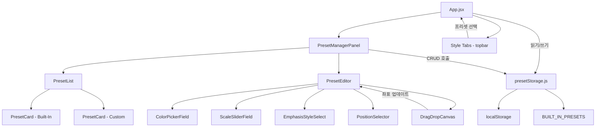
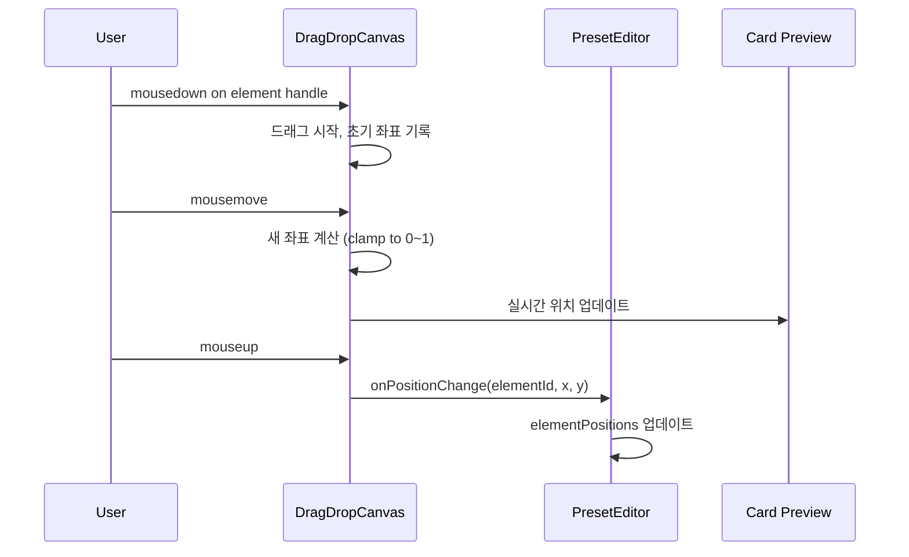

# 디자인 문서: 프리셋 관리 UI

## 개요

Insta Card Maker 웹 애플리케이션에 프리셋 관리 기능을 추가한다. 사용자는 기존 하드코딩된 Built-In 프리셋을 기반으로 새로운 프리셋을 생성, 복제, 편집, 삭제할 수 있다. 사용자 정의 프리셋은 localStorage에 JSON 형식으로 저장되며, 기존 렌더러와 완전히 호환된다.

기존 아키텍처(React + Vite + Tailwind + shadcn/ui)를 그대로 활용하며, 프리셋 관리 패널을 사이드 시트(side sheet) 형태로 추가한다. 추가로 프리셋 내 제목/본문의 위치 제어(titlePosition, bodyAlign)와 드래그 앤 드롭 자유 배치 모드(elementPositions)를 지원한다.

## 아키텍처



프리셋 관리 패널은 topbar의 Sparkles(✨) 아이콘 버튼을 클릭하면 열리는 사이드 시트로 구현한다. 이 버튼은 현재 `aria-label="스타일 메뉴"`로 존재하지만 기능이 없는 상태이다.

## 컴포넌트 및 인터페이스

### 1. `presetStorage.js` (데이터 레이어)

프리셋 데이터의 CRUD를 담당하는 순수 모듈. localStorage와 Built-In 프리셋을 통합 관리한다.

```javascript
// web/src/lib/presetStorage.js

const STORAGE_KEY = "instaCard.customPresets";

/**
 * localStorage에서 사용자 정의 프리셋을 읽어온다.
 * @returns {Object} - { [presetName]: PresetObject }
 */
export function loadCustomPresets() { ... }

/**
 * 사용자 정의 프리셋을 localStorage에 저장한다.
 * @param {Object} customPresets - { [presetName]: PresetObject }
 */
export function saveCustomPresets(customPresets) { ... }

/**
 * Built-In 프리셋과 사용자 정의 프리셋을 병합하여 반환한다.
 * 사용자 정의 프리셋이 Built-In과 이름이 겹치면 사용자 정의가 우선하지 않는다 (Built-In은 보호).
 * @returns {Object} - { [presetName]: PresetObject }
 */
export function getAllPresets() { ... }

/**
 * 새 사용자 정의 프리셋을 추가한다.
 * @param {string} name - 프리셋 이름 (kebab-case)
 * @param {PresetObject} preset - 프리셋 데이터
 * @returns {{ success: boolean, error?: string }}
 */
export function addCustomPreset(name, preset) { ... }

/**
 * 기존 사용자 정의 프리셋을 업데이트한다.
 * @param {string} name - 프리셋 이름
 * @param {PresetObject} preset - 업데이트할 프리셋 데이터
 * @returns {{ success: boolean, error?: string }}
 */
export function updateCustomPreset(name, preset) { ... }

/**
 * 사용자 정의 프리셋을 삭제한다.
 * @param {string} name - 프리셋 이름
 * @returns {{ success: boolean, error?: string }}
 */
export function deleteCustomPreset(name) { ... }

/**
 * 프리셋을 복제하여 고유한 이름을 생성한다.
 * @param {string} sourceName - 원본 프리셋 이름
 * @returns {{ name: string, preset: PresetObject } | { error: string }}
 */
export function duplicatePreset(sourceName) { ... }

/**
 * 프리셋 이름이 Built-In인지 확인한다.
 * @param {string} name - 프리셋 이름
 * @returns {boolean}
 */
export function isBuiltIn(name) { ... }
```

### 2. `presetValidator.js` (유효성 검증)

프리셋 데이터의 유효성을 검증하는 순수 함수 모듈.

```javascript
// web/src/lib/presetValidator.js

/**
 * 프리셋 이름 유효성 검증.
 * 영문 소문자, 숫자, 하이픈만 허용. 빈 문자열 불가.
 * @param {string} name
 * @returns {{ valid: boolean, error?: string }}
 */
export function validatePresetName(name) { ... }

/**
 * CSS 색상 값 유효성 검증 (hex 또는 rgba 형식).
 * @param {string} value
 * @returns {{ valid: boolean, error?: string }}
 */
export function validateColor(value) { ... }

/**
 * Scale 속성 값 유효성 검증 (0 < value <= 1).
 * @param {number} value
 * @returns {{ valid: boolean, error?: string }}
 */
export function validateScale(value) { ... }

/**
 * Emphasis style 유효성 검증.
 * @param {string} value
 * @returns {{ valid: boolean, error?: string }}
 */
export function validateEmphasisStyle(value) { ... }

/**
 * 전체 프리셋 객체 유효성 검증.
 * @param {string} name
 * @param {PresetObject} preset
 * @returns {{ valid: boolean, errors: Array<{ field: string, error: string }> }}
 */
export function validatePreset(name, preset) { ... }

/**
 * titlePosition 유효성 검증 ("top", "center", "bottom").
 * @param {string} value
 * @returns {{ valid: boolean, error?: string }}
 */
export function validateTitlePosition(value) { ... }

/**
 * bodyAlign 유효성 검증 ("start", "center", "end").
 * @param {string} value
 * @returns {{ valid: boolean, error?: string }}
 */
export function validateBodyAlign(value) { ... }

/**
 * elementPositions 좌표값 유효성 검증 (각 x, y가 0~1 범위).
 * @param {Object} positions - { title?: { x, y }, body?: { x, y } }
 * @returns {{ valid: boolean, errors: Array<{ field: string, error: string }> }}
 */
export function validateElementPositions(positions) { ... }
```

### 3. `PresetManagerPanel` (UI 컴포넌트)

프리셋 관리의 메인 패널. 사이드 시트 형태로 오른쪽에서 슬라이드인 된다.

```jsx
// web/src/components/PresetManagerPanel.jsx

/**
 * Props:
 * - open: boolean - 패널 열림 상태
 * - onClose: () => void - 패널 닫기 콜백
 * - onPresetsChange: (allPresets: Object) => void - 프리셋 변경 시 부모에 알림
 * - currentPreset: string - 현재 선택된 프리셋 이름
 * - onSelectPreset: (name: string) => void - 프리셋 선택 콜백
 */
export default function PresetManagerPanel({ open, onClose, onPresetsChange, currentPreset, onSelectPreset }) {
  // 내부 상태: 'list' | 'edit'
  // list 모드: 프리셋 목록 표시
  // edit 모드: 프리셋 편집 폼 표시
}
```

### 4. `PresetEditor` (편집 폼 컴포넌트)

프리셋 속성을 편집하는 폼. 색상 필드에는 네이티브 `<input type="color">`를 활용하고, rgba 값은 텍스트 입력으로 처리한다.

```jsx
// web/src/components/PresetEditor.jsx

/**
 * Props:
 * - initialName: string - 초기 프리셋 이름 (편집 시)
 * - initialPreset: PresetObject - 초기 프리셋 데이터
 * - isNew: boolean - 새 프리셋 생성 모드 여부
 * - onSave: (name: string, preset: PresetObject) => void
 * - onCancel: () => void
 */
export default function PresetEditor({ initialName, initialPreset, isNew, onSave, onCancel }) {
  // 폼 필드를 카테고리별로 그룹화:
  // 1. 기본 정보: name, description
  // 2. 색상: bgColor, titleColor, textColor, mutedColor, lineColor, panelColor, panelStrongColor
  // 3. 배경: backgroundLayers, imageOverlay
  // 4. 타이포그래피: fontFamily, titleWeight, titleLetterSpacing, bodyLetterSpacing
  // 5. 스케일: titleScalePortrait, titleScaleLandscape, bodyScalePortrait, bodyScaleLandscape 등
  // 6. 레이아웃: padXRatio, padTopRatio, padBottomRatio, titleGapRatio, titlePosition, bodyAlign
  // 7. 강조 스타일: emphasisStyle
  // 8. 자유 배치: freePositionMode 토글, DragDropCanvas (활성화 시)
}
```

### 5. App.jsx 수정

기존 App.jsx에 프리셋 관리 패널 통합:

- Sparkles 버튼 클릭 시 `PresetManagerPanel` 열기
- `loadPresets` 함수를 `getAllPresets()`를 사용하도록 변경
- 프리셋 변경 시 스타일 탭과 렌더러에 반영

### 6. `PositionSelector` (위치 선택 컴포넌트)

제목 위치와 본문 정렬을 시각적으로 선택할 수 있는 컴포넌트.

```jsx
// web/src/components/PositionSelector.jsx

/**
 * Props:
 * - label: string - 필드 라벨 ("제목 위치", "본문 정렬" 등)
 * - value: string - 현재 선택값
 * - options: Array<{ value: string, label: string }> - 선택 가능한 옵션
 * - onChange: (value: string) => void - 값 변경 콜백
 * - preview: boolean - 미니 미리보기 표시 여부
 */
export default function PositionSelector({ label, value, options, onChange, preview }) {
  // 각 옵션을 버튼 그룹으로 표시
  // 선택된 옵션에 시각적 하이라이트
  // preview=true일 때 각 옵션 옆에 레이아웃 미니 다이어그램 표시
}
```

### 7. `DragDropCanvas` (드래그 앤 드롭 캔버스 컴포넌트)

카드 미리보기 위에서 요소를 드래그하여 자유롭게 배치할 수 있는 캔버스.

```jsx
// web/src/components/DragDropCanvas.jsx

/**
 * Props:
 * - width: number - 캔버스 너비 (카드 미리보기 크기)
 * - height: number - 캔버스 높이
 * - elements: Array<{ id: string, label: string, x: number, y: number }> - 배치 가능한 요소 목록 (x, y는 0~1 비율)
 * - onPositionChange: (elementId: string, x: number, y: number) => void - 위치 변경 콜백
 * - previewHtml: string - 배경으로 표시할 카드 미리보기 HTML
 * - enabled: boolean - 드래그 활성화 여부 (자유 배치 모드)
 */
export default function DragDropCanvas({ width, height, elements, onPositionChange, previewHtml, enabled }) {
  // 카드 미리보기를 iframe 또는 div 배경으로 표시
  // 각 요소를 드래그 가능한 핸들로 오버레이
  // pointer events (mousedown/mousemove/mouseup, touch 지원)로 드래그 구현
  // 드래그 중 요소가 캔버스 경계(0~1) 밖으로 나가지 않도록 clamp
  // 위치 변경 시 onPositionChange 콜백으로 비율값 전달
}
```

**드래그 앤 드롭 구현 방식:**



## 데이터 모델

### PresetObject 구조

```typescript
interface PresetObject {
  // 기본 정보
  description: string;
  fontFamily: string;
  
  // 색상 속성 (Color_Property)
  bgColor: string;           // hex: "#000000"
  titleColor: string;        // hex: "#2ca8ff"
  textColor: string;         // hex: "#f7f7f7"
  mutedColor: string;        // rgba: "rgba(255, 255, 255, 0.72)"
  lineColor: string;         // rgba: "rgba(255, 255, 255, 0.18)"
  panelColor: string;        // rgba: "rgba(255, 255, 255, 0.06)"
  panelStrongColor: string;  // rgba: "rgba(255, 255, 255, 0.1)"
  
  // 배경
  backgroundLayers: string;  // CSS gradient 또는 "none"
  imageOverlay: string;      // CSS gradient
  
  // 스케일 속성 (Scale_Property) - 0 < value <= 1
  titleScalePortrait: number;
  titleScaleLandscape: number;
  titleScaleFloor: number;
  bodyScalePortrait: number;
  bodyScaleLandscape: number;
  smallTextScale: number;
  titleMinScale: number;
  bodyMinScale: number;
  
  // 타이포그래피
  titleLineHeight: number;
  bodyLineHeight: number;
  titleWeight: number;
  titleLetterSpacing: number;
  bodyLetterSpacing: number;
  
  // 레이아웃
  padXRatio: number;
  padTopRatio: number;
  padBottomRatio: number;
  titleGapRatio: number;
  
  // 위치 제어 (요구사항 9)
  titlePosition?: "top" | "center" | "bottom";  // 기본값: "top"
  bodyAlign?: "start" | "center" | "end";        // 기본값: "start"
  
  // 자유 배치 모드 (요구사항 10)
  freePositionMode?: boolean;                     // 기본값: false
  elementPositions?: {
    title?: { x: number; y: number };             // 0~1 비율값
    body?: { x: number; y: number };              // 0~1 비율값
  };
  
  // 강조 스타일
  emphasisStyle: "accent-underline" | "highlight" | "bold" | "glow";
  
  // 선택적: hero 레이아웃 전용
  layout?: "hero-overlay";
  heroTitleScale?: number;
  heroKickerScale?: number;
  heroCalloutScale?: number;
  heroBottomScale?: number;
  heroLogoScale?: number;
  heroPadXRatio?: number;
  heroPadTopRatio?: number;
  heroPadBottomRatio?: number;
}
```

### localStorage 저장 형식

```json
{
  "instaCard.customPresets": {
    "my-dark-theme": {
      "description": "나만의 다크 테마",
      "fontFamily": "Pretendard, sans-serif",
      "bgColor": "#1a1a2e",
      "titleColor": "#e94560",
      ...
    }
  }
}
```

### 기본값 (새 프리셋 생성 시)

`reference` 프리셋의 값을 기본값으로 사용한다. 사용자가 처음부터 만들 때도 합리적인 기본값이 제공되어야 한다. 새로 추가된 위치 관련 속성의 기본값:

- `titlePosition`: `"top"` (기존 동작과 동일)
- `bodyAlign`: `"start"` (기존 동작과 동일)
- `freePositionMode`: `false`
- `elementPositions`: `undefined` (자유 배치 모드 비활성화 시 사용하지 않음)

### 렌더러 레이아웃 로직

`renderCardHtml` 함수는 프리셋의 위치 속성에 따라 다른 CSS 레이아웃을 생성한다:

**1. 기본 모드 (freePositionMode = false)**

```css
/* titlePosition에 따른 flex 레이아웃 */
.card {
  display: flex;
  flex-direction: column;
  /* titlePosition: "top" → 기본 (변경 없음) */
  /* titlePosition: "center" → justify-content: center */
  /* titlePosition: "bottom" → h1을 body 뒤로 이동 (order 사용) */
}

/* bodyAlign에 따른 본문 정렬 */
.body {
  /* bodyAlign: "start" → 기본 */
  /* bodyAlign: "center" → margin: auto 0 */
  /* bodyAlign: "end" → margin-top: auto */
}
```

`titlePosition: "center"`일 때는 `.card`에 `justify-content: center`를 추가하고, `titlePosition: "bottom"`일 때는 `h1`에 `order: 1`을, `.body`에 `order: 0`을 부여하여 순서를 뒤집는다.

**2. 자유 배치 모드 (freePositionMode = true)**

```css
.card {
  position: relative;
  /* flex 레이아웃 비활성화 */
}
h1 {
  position: absolute;
  left: calc(var(--title-x) * 100%);
  top: calc(var(--title-y) * 100%);
  transform: translate(-50%, -50%); /* 중심 기준 배치 */
}
.body {
  position: absolute;
  left: calc(var(--body-x) * 100%);
  top: calc(var(--body-y) * 100%);
}
```

자유 배치 모드에서는 `elementPositions`의 좌표값을 CSS custom properties로 변환하여 absolute 위치 지정을 사용한다.


## 정확성 속성 (Correctness Properties)

*속성(property)이란 시스템의 모든 유효한 실행에서 참이어야 하는 특성 또는 동작이다. 속성은 사람이 읽을 수 있는 명세와 기계가 검증할 수 있는 정확성 보장 사이의 다리 역할을 한다.*

### Property 1: 프리셋 저장/로드 Round-Trip

*For any* 유효한 프리셋 이름과 유효한 PresetObject에 대해, `addCustomPreset`으로 저장한 후 `loadCustomPresets`로 로드하면 동일한 PresetObject가 반환되어야 한다. 마찬가지로 `updateCustomPreset`으로 수정한 후 로드해도 수정된 값이 정확히 반환되어야 한다.

**Validates: Requirements 2.4, 4.2, 8.1**

### Property 2: 프리셋 병합 완전성

*For any* 사용자 정의 프리셋 집합에 대해, `getAllPresets()`의 반환값은 모든 Built-In 프리셋 키와 모든 Custom 프리셋 키를 포함해야 하며, 각 프리셋은 렌더러가 요구하는 동일한 구조(필수 속성 포함)를 가져야 한다.

**Validates: Requirements 1.1, 6.3, 8.2**

### Property 3: 프리셋 이름 유효성 검증

*For any* 문자열에 대해, `validatePresetName`은 영문 소문자, 숫자, 하이픈만으로 구성된 비어있지 않은 문자열이면 valid를 반환하고, 그 외의 경우(빈 문자열, 대문자, 특수문자, 공백 포함)에는 invalid를 반환해야 한다.

**Validates: Requirements 2.5, 2.6, 7.1**

### Property 4: 전체 프리셋 유효성 검증

*For any* PresetObject에 대해, `validatePreset`은 모든 Color_Property가 유효한 CSS 색상이고, 모든 Scale_Property가 0 < value <= 1 범위이며, emphasisStyle이 허용된 값 중 하나일 때만 valid를 반환해야 한다. 하나라도 유효하지 않으면 해당 필드와 오류 내용을 포함한 errors 배열을 반환해야 한다.

**Validates: Requirements 7.2, 7.3, 7.4, 7.5**

### Property 5: 프리셋 복제 동등성

*For any* 존재하는 프리셋에 대해, `duplicatePreset`을 호출하면 반환된 프리셋의 모든 속성값이 원본과 동일해야 하며, 생성된 이름은 기존 프리셋 이름과 중복되지 않는 고유한 이름이어야 한다.

**Validates: Requirements 3.1, 3.2**

### Property 6: 프리셋 삭제 후 부재

*For any* 사용자 정의 프리셋에 대해, `deleteCustomPreset`을 호출한 후 `getAllPresets()`의 반환값에 해당 프리셋이 포함되지 않아야 한다. Built-In 프리셋에 대해 `deleteCustomPreset`을 호출하면 실패를 반환하고 해당 프리셋은 여전히 존재해야 한다.

**Validates: Requirements 5.2, 5.4**

### Property 7: 중복 이름 거부

*For any* 이미 존재하는 프리셋 이름(Built-In 또는 Custom)에 대해, `addCustomPreset`을 동일한 이름으로 호출하면 실패를 반환하고 기존 프리셋 데이터는 변경되지 않아야 한다.

**Validates: Requirements 2.5**

### Property 8: titlePosition에 따른 렌더링 레이아웃

*For any* 유효한 프리셋과 유효한 titlePosition 값("top", "center", "bottom")에 대해, `renderCardHtml`이 생성하는 HTML은 해당 위치에 맞는 CSS 레이아웃을 포함해야 한다. titlePosition이 undefined이거나 "top"이면 기존 flex-direction:column 레이아웃과 동일해야 하고, "center"이면 justify-content:center를, "bottom"이면 order 속성을 통한 순서 반전을 포함해야 한다.

**Validates: Requirements 9.2, 9.3, 9.4**

### Property 9: 위치/정렬 열거형 유효성 검증

*For any* 문자열에 대해, `validateTitlePosition`은 "top", "center", "bottom" 중 하나일 때만 valid를 반환하고, `validateBodyAlign`은 "start", "center", "end" 중 하나일 때만 valid를 반환해야 한다. 그 외의 문자열은 모두 invalid를 반환해야 한다.

**Validates: Requirements 9.6, 9.7**

### Property 10: 드래그 좌표 경계 제한

*For any* 드래그 좌표(x, y)에 대해, 좌표 변환 함수는 결과값을 항상 0~1 범위로 clamp해야 한다. 캔버스 크기 대비 픽셀 좌표를 비율로 변환할 때, 음수 입력은 0으로, 캔버스 크기를 초과하는 입력은 1로 제한되어야 한다.

**Validates: Requirements 10.3, 10.4**

### Property 11: 자유 배치 모드 렌더링 전환

*For any* 유효한 프리셋에 대해, `freePositionMode`가 true이면 `renderCardHtml`은 elementPositions의 좌표값을 사용한 absolute 위치 지정 CSS를 생성해야 하고, `freePositionMode`가 false이거나 undefined이면 flex 레이아웃 방식(titlePosition, bodyAlign 기반)의 CSS를 생성해야 한다.

**Validates: Requirements 10.5, 10.6**

### Property 12: 요소 좌표값 범위 유효성 검증

*For any* 숫자에 대해, `validateElementPositions`는 elementPositions 내 모든 x, y 좌표가 0 이상 1 이하일 때만 valid를 반환해야 한다. 하나라도 범위 밖이면 해당 필드와 오류 내용을 포함한 invalid를 반환해야 한다.

**Validates: Requirements 10.7**

## 오류 처리

| 오류 상황 | 처리 방식 |
|-----------|-----------|
| localStorage 데이터 파싱 실패 | `console.error`로 로그 기록, Built-In 프리셋만으로 동작 |
| 중복 프리셋 이름 | 오류 메시지 표시, 저장 거부 |
| 유효하지 않은 프리셋 이름 형식 | 필드 하단에 오류 메시지 표시 |
| 유효하지 않은 색상 값 | 필드 하단에 오류 메시지 표시, 저장 거부 |
| 유효하지 않은 스케일 값 | 필드 하단에 오류 메시지 표시, 저장 거부 |
| Built-In 프리셋 편집/삭제 시도 | 편집/삭제 버튼 비활성화로 사전 방지 |
| localStorage 용량 초과 | `try-catch`로 감지, 사용자에게 오류 메시지 표시 |
| 유효하지 않은 titlePosition 값 | 필드 하단에 오류 메시지 표시, 저장 거부 |
| 유효하지 않은 bodyAlign 값 | 필드 하단에 오류 메시지 표시, 저장 거부 |
| elementPositions 좌표값 범위 초과 (0~1 밖) | 필드 하단에 오류 메시지 표시, 저장 거부 |
| 드래그 중 캔버스 영역 밖 이동 | 좌표를 0~1 범위로 자동 clamp |

## 테스팅 전략

### 이중 테스팅 접근법

이 기능은 단위 테스트와 속성 기반 테스트를 모두 활용한다.

### 속성 기반 테스트 (Property-Based Tests)

- 라이브러리: **fast-check** (JavaScript/TypeScript용 PBT 라이브러리)
- 테스트 프레임워크: **Vitest**
- 최소 반복 횟수: 100회
- 각 테스트는 디자인 문서의 속성 번호를 참조하는 태그를 포함한다
- 태그 형식: `Feature: preset-management-ui, Property N: {property_text}`

### 단위 테스트 (Unit Tests)

단위 테스트는 다음에 집중한다:
- Edge case: localStorage 손상 데이터 처리, 복제 시 이름 충돌 해결
- 특정 예시: "reference" 프리셋이 항상 Built-In으로 인식되는지
- 통합 포인트: getAllPresets()가 렌더러와 호환되는 형식을 반환하는지

### 테스트 대상 모듈

| 모듈 | 테스트 유형 | 속성 번호 |
|------|------------|-----------|
| `presetValidator.js` | 속성 기반 테스트 | Property 3, 4, 9, 12 |
| `presetStorage.js` | 속성 기반 테스트 + 단위 테스트 | Property 1, 2, 5, 6, 7 |
| `renderer.js` | 속성 기반 테스트 | Property 8, 11 |
| `DragDropCanvas.jsx` | 속성 기반 테스트 + 단위 테스트 | Property 10 |
| `PresetManagerPanel.jsx` | 단위 테스트 (edge case) | - |
| `PresetEditor.jsx` | 단위 테스트 (edge case) | - |
| `PositionSelector.jsx` | 단위 테스트 (edge case) | - |
